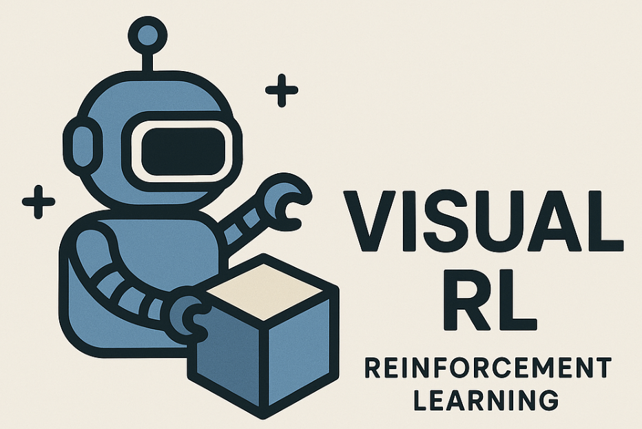

# Awesome-Visual-Reinforcement-Learning
📖 This is a repository for organizing papers, codes and other resources related to Visual Reinforcement Learning.

  

#### :thinking: What is Visual Reinforcement Learning?

**Visual Reinforcement Learning (Visual RL)** enables agents to learn decision-making policies directly from visual observations (e.g., images or videos), rather than structured state inputs.
It lies at the intersection of reinforcement learning and computer vision, with applications in robotics, embodied AI, games, and interactive environments.

#### 📌 Project Description
Awesome-Visual-Reinforcement-Learning is a curated list of papers, libraries, and resources on learning control policies from visual input.
It aims to help researchers and practitioners navigate the fast-evolving Visual RL landscape — from perception and representation learning to policy learning and real-world applications.

## 📚 Table of Contents <!-- omit in toc -->
Libraries and tools

- [Benchmarks environments and datasets with Visual RL](#benchmarks-environments-and-datasets-with-visual-rl)
- [Visual Perception with RL](#visual-perception-with-rl)
- [Multi-Modal Large Language Models with RL](#multi-modal-large-language-models-with-rl)
- [Visual Agents with RL](#visual-agents-with-rl)
- [Visual Generation with RL](#visual-generation-with-rl)
- [Visual World Models with RL](#visual-world-models-with-rl)
- [RL for Embodied AI/Robotics](#rl-for-embodied-ai/robotics)
- [Others](#others)

### Benchmarks environments and datasets with Visual RL

#### MLLM

+ [Exploring the Effect of Reinforcement Learning on Video Understanding: Insights from SEED-Bench-R1](https://arxiv.org/pdf/2503.24376) (Mar. 2025, arXiv)
  
  

### Visual Perception with RL
**Definition**: Focus on learning effective visual representations—including segmentation, depth estimation, and object recognition—from pixel inputs to guide RL agent decision-making.

+ [Visual-RFT: Visual Reinforcement Fine-Tuning](https://arxiv.org/abs/2503.01785) (Mar. 2025, arXiv)
  
  

### Multi-Modal Large Language Models with RL

+ [One RL to See Them All: Visual Triple Unified Reinforcement Learning](https://arxiv.org/abs/2505.18129) (Mar. 2025, arXiv)
  
  

  
+ [Visionary-R1: Mitigating Shortcuts in Visual Reasoning with Reinforcement Learning](https://arxiv.org/pdf/2505.14677) (Mar. 2025, arXiv)
  
  
  

### Visual Agents with RL

+ [UI-R1: Enhancing Action Prediction of GUI Agents by Reinforcement Learning](https://arxiv.org/pdf/2305.15260) (Mar. 2025, arXiv)
  
  
  

### Visual World Models with RL
**Definition**: Learn predictive models of environment dynamics from visual inputs to enable planning and long-horizon reasoning in RL.

+ [Mastering Diverse Domains through World Models](https://www.nature.com/articles/s41586-025-08744-2.pdf) (2025, Nature)
  
  

+ [CoWorld: Making Offline RL Online: Collaborative World Models for Offline Visual Reinforcement Learning](https://arxiv.org/pdf/2305.15260) (2024, NeurIPS)
  
  
  

+ [LS-Imagine: Open-World Reinforcement Learning over Long Short-Term Imagination](https://arxiv.org/abs/2410.03618) (2025, ICLR oral)
  
  
  

### Visual Generation with RL

**Definition**: Study RL agents that generate or manipulate visual content to achieve goals or enable creative visual tasks.

+ [Selftok: Discrete Visual Tokens of Autoregression, by Diffusion, and for Reasoning](https://arxiv.org/abs/2505.07538) (Jun. 2025, arXiv)
  
  
  

+ [DanceGRPO: Unleashing GRPO on Visual Generation](https://arxiv.org/abs/2505.07818) (Jun. 2025, arXiv)
  
  
  

### RL for Embodied AI/Robotics

+ [Selective Visual Representations Improve Convergence and Generalization for Embodied AI](https://openreview.net/pdf?id=kC5nZDU5zf) (2024, ICLR Spotlight)
  
  

+ [Visual IRL for Human-Like Robotic Manipulation](https://arxiv.org/pdf/2412.11360) (Dec. 2024, arXiv)
  
  

### Others

+ [Can RL From Pixels be as Efficient as RL From State?](https://bair.berkeley.edu/blog/2020/07/19/curl-rad/) (Jul. 2025, Blog)

+ [Deep Reinforcement Learning Course from Hugging Face](https://huggingface.co/learn/deep-rl-course/en/unit0/introduction) (Hugging Face)

+ [Reinforced MLLM: A Survey on RL-Based Reasoning in Multimodal Large Language Models](https://arxiv.org/pdf/2504.21277) (May. 2025, arXiv)

#### :high_brightness: This project is still on-going, pull requests are welcomed!!
If you have any suggestions (missing papers, new papers, or typos), please feel free to edit and submit a pull request. Even just suggesting paper titles is a great contribution — you can also open an issue or contact us via email.

#### :star: If you find this repo useful, please star it!!!

## Acknowledgements

This template is provided by [Awesome-Video-Diffusion](https://github.com/showlab/Awesome-Video-Diffusion). And our approach builds upon numerous contributions from prior resource, such as [Awesome Visual RL](https://github.com/qiwang067/awesome-visual-rl).

