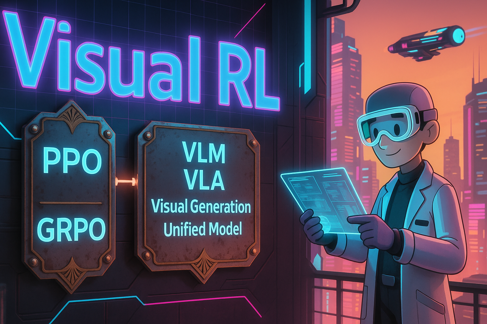
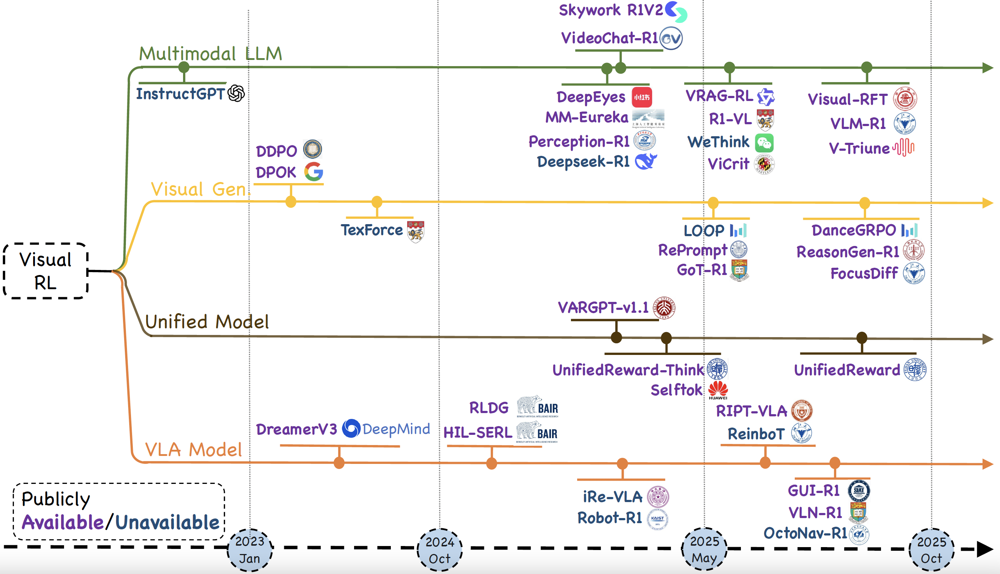
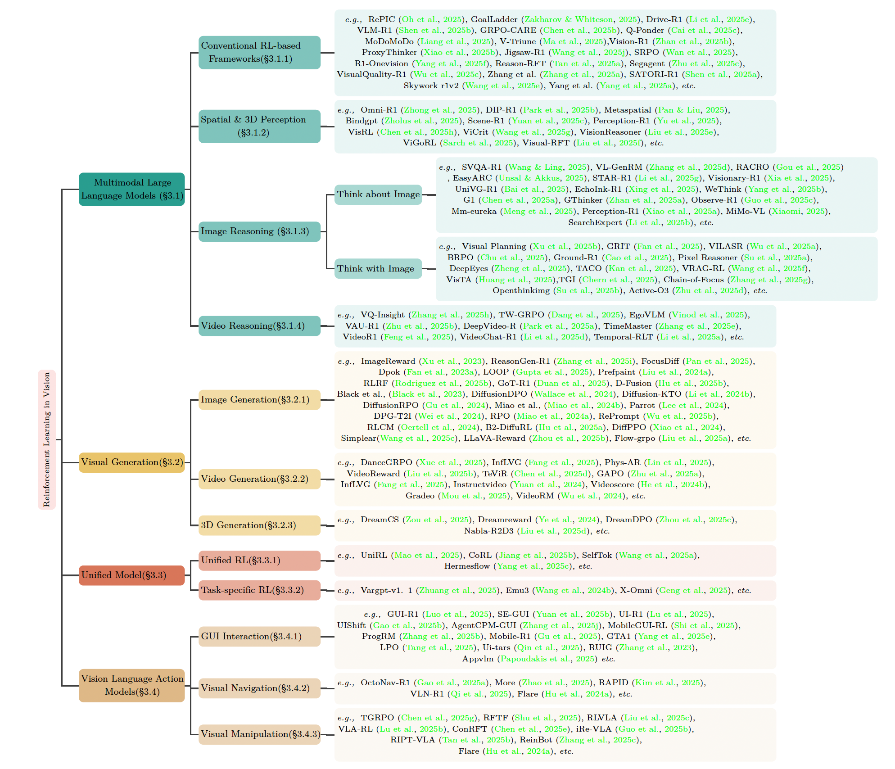

# Awesome-Visual-Reinforcement-Learning

<div align="center">
  
  <p align="center">
    This repository accompanies our survey paper: <br><a href="https://arxiv.org/abs/2508.08189"><strong>Reinforcement Learning in Vision: A Survey</strong></a>
  </p>
</div>


<div align="center">
  <a href="https://arxiv.org/abs/2508.08189">
    
  </a>
  <a href="https://github.com/weijiawu/Awesome-Visual-Reinforcement-Learning">
    
  </a>
  <a href="https://huggingface.co/papers/2508.08189">
    
  </a>
  <a href="https://x.com/weijiawu7/status/1955159048934088713">
    
  </a>
</div>


<!-- 📖 This is a repository for organizing papers, codes and other resources related to Visual Reinforcement Learning. -->


---


## 🔔 News
-   **[2025-08-13]** We have released ["Reinforcement Learning in Vision: A Survey"](https://arxiv.org/abs/2508.08189), the **first comprehensive survey** dedicated to the emerging paradigm of "Visual RL". 
-   **[2025-08-13]** We reorganized the repository and aligned the classifications in the survey. 
-   **[2025-06-08]** We created this repository to maintain a paper list on Awesome-Visual-Reinforcement-Learning. **<span style="color:red">Everyone is welcome to push and update related work!</span>**


---


#### :thinking: What is Visual Reinforcement Learning?

**Visual Reinforcement Learning (Visual RL)** enables agents to learn decision-making policies directly from visual observations (e.g., images or videos), rather than structured state inputs.
It lies at the intersection of reinforcement learning and computer vision, with applications in robotics, embodied AI, games, and interactive environments.

#### 📌 Project Description
Awesome-Visual-Reinforcement-Learning is a curated list of papers, libraries, and resources on learning control policies from visual input.
It aims to help researchers and practitioners navigate the fast-evolving Visual RL landscape — from perception and representation learning to policy learning and real-world applications.


<p align="center">
  
</p>


We structure this collection along a trajectory of visual RL. This chart ugroups existing work by high-level domain (MLLMs, visual generation, unified models, and vision-language action agents) and then by finer-grained tasks, illustrating representative papers for each branch.:


<p align="center">
  
</p>


## 📚 Table of Contents <!-- omit in toc -->
Libraries and tools

- [Benchmarks environments and datasets with Visual RL](#benchmarks-environments-and-datasets-with-visual-rl)
- [Multi-Modal Large Language Models with RL](#multi-modal-large-language-models-with-rl)
- [Visual Generation with RL](#visual-generation-with-rl)
- [RL for Unified Model](#rl-for-unified-model)
- [Vision Language Action Models with RL](#vision-language-action-models-with-rl)
- [Others](#others)


### Benchmarks environments and datasets with Visual RL

#### MLLM

+ [MM-Eureka: Exploring the Frontiers of Multimodal Reasoning with Rule-based Reinforcement Learning](https://arxiv.org/abs/2503.07365) (Mar. 2025)
  [](https://arxiv.org/abs/2503.07365)
  [](https://github.com/ModalMinds/MM-EUREKA)


+ [Exploring the Effect of Reinforcement Learning on Video Understanding: Insights from SEED-Bench-R1](https://arxiv.org/pdf/2503.24376) (Mar. 2025)
  [](https://arxiv.org/pdf/2503.24376)
  [](https://github.com/TencentARC/SEED-Bench-R1)


+ [Video-Holmes: Can MLLM Think Like Holmes for Complex Video Reasoning?](https://arxiv.org/pdf/2505.21374) (May. 2025)
  [](https://arxiv.org/pdf/2505.21374)
  [](https://github.com/TencentARC/Video-Holmes)
  [](https://video-holmes.github.io/Page.github.io/)
  
### Multi-Agent

+ [FightLadder: A Benchmark for Competitive Multi-Agent Reinforcement Learning](https://arxiv.org/abs/2406.02081) (2024, ICML)
  [](https://arxiv.org/abs/2406.02081)
  [](https://github.com/wenzhe-li/FightLadder)
  [](https://sites.google.com/view/fightladder/home)


### Multi-Modal Large Language Models with RL

#### Conventional RL-based Frameworks for MLLM
**Definition**: We refer to conventional RL-based MLLMs as approaches that apply reinforcement learning primarily to align a vision–language backbone with verifiable, task-level rewards, without explicitly modeling multi-step chain-of-thought reasoning.

+ [RL makes MLLMs see better than SFT](https://arxiv.org/abs/2510.16333) (Oct. 2025)
  [](https://arxiv.org/abs/2510.16333)
  

+ [CapRL: Stimulating Dense Image Caption Capabilities via Reinforcement Learning](https://arxiv.org/pdf/2509.22647) (Sep. 2025)
  [](https://arxiv.org/pdf/2509.22647)
  [](https://github.com/InternLM/CapRL)


+ [THOR: Tool-Integrated Hierarchical Optimization via RL for Mathematical Reasoning](https://arxiv.org/pdf/2509.13761) (Sep. 2025)
  [](https://arxiv.org/pdf/2509.13761)
  [](https://github.com/JingMog/THOR)

+ [LENS: Learning to Segment Anything with Unified Reinforced Reasoning](https://arxiv.org/pdf/2508.14153) (Aug. 2025)
  [](https://arxiv.org/pdf/2508.14153)
  [](https://github.com/hustvl/LENS)

+ [DocR1: Evidence Page-Guided GRPO for Multi-Page Document Understanding](https://arxiv.org/abs/2508.07313) (Aug. 2025)
  [](https://arxiv.org/abs/2508.07313)


+ [BigCharts-R1: Enhanced Chart Reasoning with Visual Reinforcement Finetuning](https://arxiv.org/abs/2508.09804) (Aug. 2025)
  [](https://arxiv.org/abs/2508.09804)

<!-- before context is new 19-8-2025 -->


+ [RePIC: Reinforced Post-Training for Personalizing Multi-Modal Language Models](https://arxiv.org/abs/2506.18369) (Jun. 2025)
  [](https://arxiv.org/abs/2506.18369)
  [](https://github.com/oyt9306/RePIC)

+ [GoalLadder: Incremental Goal Discovery with Vision-Language Models](https://arxiv.org/abs/2506.16396) (Jun. 2025)
  [](https://arxiv.org/abs/2506.16396)

+ [Drive-R1: Bridging Reasoning and Planning in VLMs for Autonomous Driving with Reinforcement Learning](https://arxiv.org/abs/2506.18234) (Jun. 2025)
  [](https://arxiv.org/abs/2506.18234)

+ [VLM-R1: A Stable and Generalizable R1-style Large Vision-Language Model](https://arxiv.org/pdf/2504.07615) (May. 2025)
  [](https://arxiv.org/pdf/2504.07615)
  [](https://github.com/om-ai-lab/VLM-R1)

+ [GRPO-CARE: Consistency-Aware Reinforcement Learning for Multimodal Reasoning](https://arxiv.org/pdf/2506.16141) (Jun. 2025)
  [](https://arxiv.org/pdf/2506.16141)
  [](https://github.com/TencentARC/GRPO-CARE)

+ [Q-Ponder: A Unified Training Pipeline for Reasoning-based Visual Quality Assessment](https://arxiv.org/pdf/2506.05384) (Jun. 2025)
  [](https://arxiv.org/pdf/2506.05384)
  [](https://github.com/vivoCameraResearch/Q-Ponder)
  [](https://vivocameraresearch.github.io/qponder/)

+ [MoDoMoDo: Multi-Domain Data Mixtures for Multimodal LLM Reinforcement Learning](https://arxiv.org/abs/2505.24871) (May. 2025)
  [](https://arxiv.org/abs/2505.24871)
  [](https://github.com/lynl7130/MoDoMoDo)
  [](https://modomodo-rl.github.io/)

+ [One RL to See Them All: Visual Triple Unified Reinforcement Learning](https://arxiv.org/abs/2505.18129) (Mar. 2025)
  [](https://arxiv.org/abs/2505.18129)
  [](https://github.com/MiniMax-AI/One-RL-to-See-Them-All)

+ [Vision-R1: Evolving Human-Free Alignment in Large Vision-Language Models via Vision-Guided Reinforcement Learning](https://arxiv.org/pdf/2503.18013) (May. 2025)
  [](https://arxiv.org/pdf/2503.18013)
  [](https://github.com/jefferyZhan/Griffon)

+ [ProxyThinker: Test-Time Guidance through Small Visual Reasoners](https://arxiv.org/abs/2505.24872) (Mar. 2025)
  [](https://arxiv.org/abs/2505.24872)
  [](https://github.com/MrZilinXiao/ProxyThinker)

+ [Jigsaw-R1: A Study of Rule-based Visual Reinforcement Learning with Jigsaw Puzzles](https://arxiv.org/abs/2505.23590) (Mar. 2025)
  [](https://arxiv.org/abs/2505.23590)
  [](https://github.com/zifuwanggg/Jigsaw-R1)

+ [SRPO: Enhancing Multimodal LLM Reasoning via Reflection-Aware Reinforcement Learning](https://arxiv.org/abs/2506.01713) (Jun. 2025)
  [](https://arxiv.org/abs/2506.01713)
  [](https://github.com/SUSTechBruce/SRPO_MLLMs)
  [](https://srpo.pages.dev/#abstraction)

+ [R1-Onevision: Advancing Generalized Multimodal Reasoning through Cross-Modal Formalization](https://arxiv.org/abs/2503.10615) (Mar. 2025)
  [](https://arxiv.org/abs/2503.10615)
  [](https://github.com/Fancy-MLLM/R1-onevision)
  [](https://huggingface.co/spaces/Fancy-MLLM/R1-Onevision)

+ [Reason-RFT: Reinforcement Fine-Tuning for Visual Reasoning](https://arxiv.org/abs/2503.20752) (May. 2025)
  [](https://arxiv.org/abs/2503.20752)
  [](https://github.com/tanhuajie/Reason-RFT)
  [](https://tanhuajie.github.io/ReasonRFT/)

+ [SegAgent: Exploring Pixel Understanding Capabilities in MLLMs by Imitating Human Annotator Trajectories](https://arxiv.org/abs/2503.08625) (Mar. 2025)
  [](https://arxiv.org/abs/2503.08625)
  [](https://github.com/aim-uofa/SegAgent)
  [](https://aim-uofa.github.io/SegAgent/)

+ [VisualQuality-R1: Reasoning-Induced Image Quality Assessment via Reinforcement Learning to Rank](https://arxiv.org/pdf/2505.14460) (Mar. 2025)
  [](https://arxiv.org/pdf/2505.14460)
  [](https://github.com/TianheWu/VisualQuality-R1)

+ [Improving the Reasoning of Multi-Image Grounding in MLLMs via Reinforcement Learning](https://arxiv.org/abs/2507.00748) (July. 2025)
  [](https://arxiv.org/abs/2507.00748)

+ [SATORI-R1: Incentivizing Multimodal Reasoning with Spatial Grounding and Verifiable Rewards](https://arxiv.org/abs/2505.19094) (Mar. 2025)
  [](https://arxiv.org/abs/2505.19094)
  [](https://github.com/justairr/SATORI-R1)


<!-- + [Integrating Saliency Ranking and Reinforcement Learning for Enhanced Object Detection](https://arxiv.org/abs/2408.06803) (Aug. 2024)
  [](https://arxiv.org/abs/2408.06803)
  [](https://github.com/mbar0075/SaRLVision)
 -->

+ [Skywork R1V2: Multimodal Hybrid Reinforcement Learning for Reasoning](https://arxiv.org/pdf/2504.16656) (Apr. 2025)
  [](https://arxiv.org/pdf/2504.16656)
  [](https://github.com/SkyworkAI/Skywork-R1V)
  [](https://huggingface.co/Skywork/Skywork-R1V2-38B)

+ [MMSearch-R1: Incentivizing LMMs to Search](https://arxiv.org/abs/2506.20670) (Jun. 2025)
  [](https://arxiv.org/abs/2506.20670)
  [](https://github.com/EvolvingLMMs-Lab/multimodal-search-r1)

+ [Self-Rewarding Large Vision-Language Models for Optimizing Prompts in Text-to-Image Generation](https://arxiv.org/pdf/2505.16763) (May. 2025)
  [](https://arxiv.org/pdf/2505.16763)


#### Spatial & 3D Perception with RL for MLLMs
**Definition**: Perception centric works applies RL to sharpen object detection, segmentation and grounding without engaging in lengthy chain–of–thought reasoning.

+ [Omni-R1: Reinforcement Learning for Omnimodal Reasoning via Two-System Collaboration](https://arxiv.org/pdf/2505.20256) (May. 2025)
  [](https://arxiv.org/pdf/2505.20256)
  [](https://github.com/aim-uofa/Omni-R1)
  [](https://aim-uofa.github.io/OmniR1/)

+ [DIP-R1: Deep Inspection and Perception with RL Looking Through and Understanding Complex Scenes](https://arxiv.org/abs/2505.23179) (Mar. 2025)
  [](https://arxiv.org/abs/2505.23179)

+ [MetaSpatial: Reinforcing 3D Spatial Reasoning in VLMs for the Metaverse](https://arxiv.org/abs/2503.18470) (Mar. 2025)
  [](https://arxiv.org/abs/2503.18470)
  [](https://github.com/PzySeere/MetaSpatial)

+ [BindGPT: A Scalable Framework for 3D Molecular Design via Language Modeling and Reinforcement Learning](https://arxiv.org/abs/2406.03686) (Jun. 2025)
  [](https://arxiv.org/abs/2406.03686)

+ [Scene-R1: Video-Grounded Large Language Models for 3D Scene Reasoning without 3D Annotations](https://arxiv.org/abs/2506.17545) (Jun. 2025)
  [](https://arxiv.org/abs/2506.17545)

+ [Perception-R1: Pioneering Perception Policy with Reinforcement Learning](https://arxiv.org/pdf/2504.07954) (Apr. 2025)
  [](https://arxiv.org/pdf/2504.07954)
  [](https://github.com/linkangheng/PR1)

+ [VisRL: Intention-Driven Visual Perception via Reinforced Reasoning](https://arxiv.org/pdf/2503.07523) (Mar. 2025)
  [](https://arxiv.org/pdf/2503.07523)
  [](https://github.com/zhangquanchen/VisRL)

+ [ViCrit: A Verifiable Reinforcement Learning Proxy Task for Visual Perception in VLMs](https://arxiv.org/pdf/2506.10128) (Jun. 2025)
  [](https://arxiv.org/pdf/2506.10128)
  [](https://github.com/si0wang/ViCrit)
  [](https://huggingface.co/datasets/zyang39/ViCrit-Train)

+ [VisionReasoner: Unified Visual Perception and Reasoning via Reinforcement Learning](https://arxiv.org/abs/2505.12081) (Mar. 2025)
  [](https://arxiv.org/abs/2505.12081)
  [](https://github.com/dvlab-research/VisionReasoner)


+ [Grounded Reinforcement Learning for Visual Reasoning](https://arxiv.org/abs/2505.23678) (Mar. 2025)
  [](https://arxiv.org/abs/2505.23678)
  [](https://github.com/Gabesarch/grounded-rl)
  [](https://visually-grounded-rl.github.io/)

+ [Visual-RFT: Visual Reinforcement Fine-Tuning](https://arxiv.org/abs/2503.01785) (Mar. 2025)
  [](https://arxiv.org/abs/2503.01785)
  [](https://github.com/Liuziyu77/Visual-RFT)

+ [Video-R1: Reinforcing Video Reasoning in MLLMs](https://arxiv.org/pdf/2503.21776) (Mar. 2025)
  [](https://arxiv.org/pdf/2503.21776)
  [](https://github.com/tulerfeng/Video-R1)

#### Image Reasoning with RL for MLLMs

##### Think about Image


+ [GLM‑4.5V and GLM‑4.1V‑Thinking: Towards Versatile Multimodal Reasoning with Scalable Reinforcement Learning](https://arxiv.org/abs/2507.01006) (Jul. 2025)
  [](https://arxiv.org/abs/2507.01006)
  [](https://github.com/zai-org/GLM-V)

<!-- before context is new 19-8-2025 -->

+ [SVQA-R1: Reinforcing Spatial Reasoning in MLLMs via View-Consistent Reward Optimization](https://arxiv.org/abs/2506.01371) (Jun. 2025)
  [](https://arxiv.org/abs/2506.01371)

+ [VL-GenRM: Enhancing Vision-Language Verification via Vision Experts and Iterative Training](https://arxiv.org/abs/2506.13888) (Jun. 2025)
  [](https://arxiv.org/abs/2506.13888)

+ [Perceptual Decoupling for Scalable Multi-modal Reasoning via Reward-Optimized Captioning](https://arxiv.org/abs/2506.04559) (Jun. 2025)
  [](https://arxiv.org/abs/2506.04559)

+ [EasyARC: Evaluating Vision Language Models on True Visual Reasoning](https://arxiv.org/abs/2506.11595) (Jun. 2025)
  [](https://arxiv.org/abs/2506.11595)

+ [STAR-R1: Spatial TrAnsformation Reasoning by Reinforcing Multimodal LLMs](https://arxiv.org/pdf/2505.15804) (Jun. 2025)
  [](https://arxiv.org/pdf/2505.15804)
  [](https://github.com/zongzhao23/STAR-R1)

+ [Visionary-R1: Mitigating Shortcuts in Visual Reasoning with Reinforcement Learning](https://arxiv.org/pdf/2505.14677) (Mar. 2025)
  [](https://arxiv.org/pdf/2505.14677)
  [](https://github.com/lll6gg/UI-R1)
  [](https://www.maifoundations.com/blog/visionary-r1/)

+ [UniVG-R1: Reasoning Guided Universal Visual Grounding with Reinforcement Learning](https://arxiv.org/abs/2505.14231) (Mar. 2025)
  [](https://arxiv.org/abs/2505.14231)
  [](https://github.com/AMAP-ML/UniVG-R1)
  [](https://amap-ml.github.io/UniVG-R1-page/)

+ [EchoInk-R1: Exploring Audio-Visual Reasoning in Multimodal LLMs via Reinforcement Learning](https://arxiv.org/pdf/2505.04623) (Mar. 2025)
  [](https://arxiv.org/pdf/2505.04623)
  [](https://github.com/HarryHsing/EchoInk/tree/main)

+ [WeThink: Toward General-purpose Vision-Language Reasoning via Reinforcement Learning](https://arxiv.org/abs/2506.07905) (Jun. 2025)
  [](https://arxiv.org/abs/2506.07905)

+ [G1: Bootstrapping Perception and Reasoning Abilities of Vision-Language Model via Reinforcement Learning](https://arxiv.org/abs/2505.13426) (Mar. 2025)
  [](https://arxiv.org/abs/2505.13426)
  [](https://github.com/chenllliang/G1)

+ [GThinker: Towards General Multimodal Reasoning via Cue-Guided Rethinking](https://arxiv.org/abs/2506.01078) (Jun. 2025)
  [](https://arxiv.org/abs/2506.01078)
  [](https://github.com/jefferyZhan/GThinker)

+ [Observe-R1: Unlocking Reasoning Abilities of MLLMs with Dynamic Progressive Reinforcement Learning](https://arxiv.org/abs/2505.12432) (Mar. 2025)
  [](https://arxiv.org/abs/2505.12432)
  [](https://github.com/zrguo/Observe-R1)

+ [Perceptual Decoupling for Scalable Multi-modal Reasoning via Reward-Optimized Captioning](https://arxiv.org/abs/2506.04559) (Jun. 2025)
  [](https://arxiv.org/abs/2506.04559)

+ [Advancing Multimodal Reasoning Capabilities of Multimodal Large Language Models via Visual Perception Reward](https://arxiv.org/abs/2506.07218) (Jun. 2025)
  [](https://arxiv.org/abs/2506.07218)

+ [MiMo-VL Technical Report](https://arxiv.org/abs/2506.03569) (Jun. 2025)
  [](https://arxiv.org/abs/2506.03569)
  [](https://github.com/XiaomiMiMo/MiMo-VL)

+ [Enhancing LLMs' Reasoning-Intensive Multimedia Search Capabilities through Fine-Tuning and Reinforcement Learning](https://arxiv.org/abs/2505.18831) (Mar. 2025)
  [](https://arxiv.org/abs/2505.18831)


##### Think with Image
**Definition**: Thinking with Images elevates the picture to an active, external workspace: models iteratively generate, crop, highlight, sketch or insert explicit visual annotations as tokens in their chain-of-thought, thereby aligning linguistic logic with grounded visual evidence.

+ [Learning Only with Images: Visual Reinforcement Learning with Reasoning, Rendering, and Visual Feedback](https://arxiv.org/abs/2507.20766) (Jul. 2025)
  [](https://arxiv.org/abs/2507.20766)
  [](https://github.com/L-O-I/RRVF)

+ [VisionThink: Smart and Efficient Vision Language Model via Reinforcement Learning](https://arxiv.org/abs/2507.13348) (Jul. 2025)
  [](https://arxiv.org/abs/2507.13348)
  [](https://github.com/dvlab-research/VisionThink)


<!-- before context is new 19-8-2025 -->

+ [Visual Planning: Let's Think Only with Images](https://arxiv.org/abs/2505.11409) (May. 2025)
  [](https://arxiv.org/abs/2505.11409)

+ [GRIT: Teaching MLLMs to Think with Images](https://arxiv.org/pdf/2505.15879) (Mar. 2025)
  [](https://arxiv.org/pdf/2505.15879)

+ [Reinforcing Spatial Reasoning in Vision-Language Models with Interwoven Thinking and Visual Drawing](https://arxiv.org/abs/2506.09965) (Jun. 2025)
  [](https://arxiv.org/abs/2506.09965)

+ [Qwen Look Again: Guiding Vision-Language Reasoning Models to Re-attention Visual Information](https://www.arxiv.org/abs/2505.23558) (Mar. 2025)
  [](https://www.arxiv.org/abs/2505.23558)
  [](https://github.com/Liar406/Look_Again)

+ [Ground-R1: Incentivizing Grounded Visual Reasoning via Reinforcement Learning](https://arxiv.org/pdf/2505.20272) (Mar. 2025)
  [](https://arxiv.org/pdf/2505.20272)

+ [Pixel Reasoner: Incentivizing Pixel-Space Reasoning with Curiosity-Driven Reinforcement Learning](https://arxiv.org/abs/2505.15966) (May. 2025)
  [](https://arxiv.org/abs/2505.15966)
  [](https://github.com/TIGER-AI-Lab/Pixel-Reasoner)
  [](https://tiger-ai-lab.github.io/Pixel-Reasoner)

+ [DeepEyes: Incentivizing “Thinking with Images” via Reinforcement Learning](https://arxiv.org/abs/2505.14362) (Mar. 2025)
  [](https://arxiv.org/abs/2505.14362)
  [](https://github.com/Visual-Agent/DeepEyes)

+ [TACO: Think-Answer Consistency for Optimized Long-Chain Reasoning and Efficient Data Learning via Reinforcement Learning in LVLMs](https://arxiv.org/abs/2505.20777) (Mar. 2025)
  [](https://arxiv.org/abs/2505.20777)

+ [VRAG-RL: Empower Vision-Perception-Based RAG for Visually Rich Information Understanding via Iterative Reasoning with Reinforcement Learning](https://arxiv.org/pdf/2505.22019) (May. 2025)
  [](https://arxiv.org/pdf/2505.22019)
  [](https://github.com/Alibaba-NLP/VRAG)
  [](https://modomodo-rl.github.io/)

+ [VisualToolAgent (VisTA): A Reinforcement Learning Framework for Visual Tool Selection](https://arxiv.org/pdf/2505.20289) (Mar. 2025)
  [](https://arxiv.org/pdf/2505.20289)

+ [Thinking with Generated Images](https://arxiv.org/abs/2505.22525) (May. 2025)
  [](https://arxiv.org/abs/2505.22525)
  [](https://github.com/GAIR-NLP/thinking-with-generated-images)

+ [Chain-of-Focus: Adaptive Visual Search and Zooming for Multimodal Reasoning via RL](https://arxiv.org/abs/2505.15436) (Mar. 2025)
  [](https://arxiv.org/abs/2505.15436)

+ [Openthinkimg: Learning to think with images via visual tool reinforcement learning](https://arxiv.org/abs/2505.08617) (May. 2025)
  [](https://arxiv.org/abs/2505.08617)
  [](https://github.com/zhaochen0110/OpenThinkIMG)

+ [Active-O3: Empowering Multimodal Large Language Models with Active Perception via GRPO](https://arxiv.org/abs/2505.21457) (May. 2025)
  [](https://arxiv.org/abs/2505.21457)
  [](https://github.com/aim-uofa/Active-o3)

+ [VRAG-RL: Empower Vision-Perception-Based RAG for Visually Rich Information Understanding via Iterative Reasoning with Reinforcement Learning](https://arxiv.org/pdf/2505.22019) (May. 2025)
  [](https://arxiv.org/pdf/2505.22019)
  [](https://github.com/Alibaba-NLP/VRAG)
  [](https://modomodo-rl.github.io/)

+ [VTool-R1: VLMs Learn to Think with Images via Reinforcement Learning on Multimodal Tool Use](https://arxiv.org/abs/2505.19255) (May. 2025)
  [](https://arxiv.org/abs/2505.19255)
  [](https://github.com/VTool-R1/VTool-R1)


#### Video Reasoning with RL for MLLMs

+ [MOSS-ChatV: Reinforcement Learning with Process Reasoning Reward for Video Temporal Reasoning](https://arxiv.org/abs/2509.21113) (Sep. 2025)
  [](https://arxiv.org/abs/2509.21113)


+ [TempSamp-R1: Effective Temporal Sampling with Reinforcement Fine-Tuning for Video LLMs](https://arxiv.org/abs/2509.18056) (Sep. 2025)
  [](https://arxiv.org/abs/2509.18056)

+ [Video-MTR: Reinforced Multi-Turn Reasoning for Long Video Understanding](https://arxiv.org/abs/2508.20478) (Aug. 2025)
  [](https://arxiv.org/abs/2508.20478)

+ [Thinking With Videos: Multimodal Tool-Augmented Reinforcement Learning for Long Video Reasoning](https://arxiv.org/abs/2508.04416) (Aug. 2025)
  [](https://arxiv.org/abs/2508.04416)

<!-- before context is new 19-8-2025 -->


+ [VQ-Insight: Teaching VLMs for AI-Generated Video Quality Understanding via Progressive Visual Reinforcement Learning](https://arxiv.org/abs/2506.18564) (Jun. 2025)
  [](https://arxiv.org/abs/2506.18564)

+ [Reinforcing Video Reasoning with Focused Thinking](https://arxiv.org/abs/2505.24718) (Mar. 2025)
  [](https://arxiv.org/abs/2505.24718)
  [](https://github.com/longmalongma/TW-GRPO)

+ [EgoVLM: Policy Optimization for Egocentric Video Understanding](https://arxiv.org/abs/2506.03097) (Jun. 2025)
  [](https://arxiv.org/abs/2506.03097)
  [](https://github.com/adityavavre/VidEgoVLM)

+ [VAU-R1: Advancing Video Anomaly Understanding via Reinforcement Fine-Tuning](https://arxiv.org/pdf/2505.23504) (Jun. 2025)
  [](https://arxiv.org/pdf/2505.23504)
  [](https://github.com/GVCLab/VAU-R1)
  [](https://github.com/GVCLab/VAU-R1?tab=readme-ov-file)

+ [DeepVideo-R1: Video Reinforcement Fine-Tuning via Difficulty-aware Regressive GRPO](https://arxiv.org/pdf/2506.07464) (Jun. 2025)
  [](https://arxiv.org/pdf/2506.07464)
  [](https://github.com/mlvlab/DeepVideoR1)

+ [TimeMaster: Training Time-Series Multimodal LLMs to Reason via Reinforcement Learning](https://arxiv.org/abs/2506.13705) (Jun. 2025)
  [](https://arxiv.org/abs/2506.13705)

+ [VideoChat-R1: Enhancing Spatio-Temporal Perception via Reinforcement Fine-Tuning](https://arxiv.org/pdf/2504.06958) (Apr. 2025)
  [](https://arxiv.org/pdf/2504.06958)

+ [Reinforcement Learning Tuning for VideoLLMs: Reward Design and Data Efficiency](https://arxiv.org/abs/2506.01908) (Jun. 2025)
  [](https://arxiv.org/abs/2506.01908)
  [](https://github.com/appletea233/Temporal-R1)


<!-- 
### Visual Perception with RL
**Definition**: Focus on learning effective visual representations—including segmentation, depth estimation, and object recognition—from pixel inputs to guide RL agent decision-making.

+ [Optimization-Free Patch Attack on Stereo Depth Estimation](https://arxiv.org/abs/2506.17632) (Jun. 2025)
  [](https://arxiv.org/abs/2506.17632)
 -->

<!-- + [Aha Moment Revisited: Are VLMs Truly Capable of Self Verification in Inference-time Scaling?](https://arxiv.org/abs/2506.17417) (Jun. 2025)
  [](https://arxiv.org/abs/2506.17417) -->

<!-- #### Video \& Temporal Understanding -->

<!-- #### Goal-Driven \& Personalized Learning -->
<!-- 

+ [Play to Generalize: Learning to Reason Through Game Play](https://arxiv.org/abs/2506.08011) (Jun. 2025)
  [](https://arxiv.org/abs/2506.08011)
  [](https://github.com/yunfeixie233/ViGaL)
  [](https://yunfeixie233.github.io/ViGaL/) -->

<!-- #### Architectural \& Reasoning Mechanisms -->


<!-- + [Machine Mental Imagery: Empower Multimodal Reasoning with Latent Visual Tokens](https://www.arxiv.org/abs/2506.17218) (Jun. 2025)
  [](https://www.arxiv.org/abs/2506.17218)
  [](https://github.com/UMass-Embodied-AGI/Mirage)
  [](https://vlm-mirage.github.io/) -->


### Visual Generation with RL

**Definition**: Study RL agents that generate or manipulate visual content to achieve goals or enable creative visual tasks.


#### Image Generation

+ [MIRO: MultI-Reward cOnditioned pretraining improves T2I quality and efficiency](https://arxiv.org/abs/2510.25897) (Oct. 2025)
  [](https://arxiv.org/abs/2510.25897)
  [](https://github.com/nicolas-dufour/miro)
  [](https://nicolas-dufour.github.io/miro/)


+ [Sample By Step, Optimize By Chunk: Chunk-Level GRPO For Text-to-Image Generation](https://arxiv.org/pdf/2510.21583) (Oct. 2025)
  [](https://arxiv.org/pdf/2510.21583)

+ [UMO: Scaling Multi-Identity Consistency for Image Customization via Matching Reward](https://arxiv.org/abs/2509.06818) (Sep. 2025)
  [](https://arxiv.org/abs/2509.06818)
  [](https://github.com/bytedance/UMO)
  [](https://bytedance.github.io/UMO/)


+ [OneReward: Unified Mask-Guided Image Generation via Multi-Task Human Preference Learning](https://arxiv.org/abs/2508.21066) (Aug. 2025)
  [](https://arxiv.org/abs/2508.21066)
  [](https://one-reward.github.io/)


+ [USO: Unified Style and Subject-Driven Generation via Disentangled and Reward Learning](https://arxiv.org/abs/2508.18966) (Aug. 2025)
  [](https://arxiv.org/abs/2508.18966)
  [](https://github.com/bytedance/USO)
  [](https://bytedance.github.io/USO/)


+ [Pref-GRPO: Pairwise Preference Reward-based GRPO for Stable Text-to-Image Reinforcement Learning](https://arxiv.org/pdf/2508.20751) (Jul. 2025)
  [](https://arxiv.org/pdf/2508.20751)
  [](https://github.com/CodeGoat24/Pref-GRPO)
  [](https://codegoat24.github.io/UnifiedReward/Pref-GRPO)


+ [TempFlow-GRPO: When Timing Matters for GRPO in Flow Models](https://arxiv.org/pdf/2508.04324) (Aug. 2025)
  [](https://arxiv.org/pdf/2508.04324)
  [](https://github.com/Shredded-Pork/TempFlow-GRPO)
  [](https://tempflowgrpo.github.io/)

+ [Qwen-Image Technical Report](https://arxiv.org/pdf/2508.02324) (Aug. 2025)
  [](https://arxiv.org/pdf/2508.02324)
  [](https://github.com/QwenLM/Qwen-Image)
  [](https://modelscope.cn/models/Qwen/Qwen-Image)

<!-- before context is new 19-8-2025 -->

+ [ImageReward: Learning and Evaluating Human Preferences for Text-to-Image Generation](https://arxiv.org/abs/2304.05977) (Apr. 2023)
  [](https://arxiv.org/abs/2304.05977)
  [](https://github.com/zai-org/ImageReward)
  [](https://zhuanlan.zhihu.com/p/639494251)

+ [ReasonGen-R1: Cot for Autoregressive Image generation models through SFT and RL](https://arxiv.org/abs/2505.24875) (May. 2025)
  [](https://arxiv.org/abs/2505.24875)
  [](https://github.com/Franklin-Zhang0/ReasonGen-R1)
  [](https://reasongen-r1.github.io/)

+ [FocusDiff: Advancing Fine-Grained Text-Image Alignment for Autoregressive Visual Generation through RL](https://arxiv.org/pdf/2506.05501) (Jun. 2025)
  [](https://arxiv.org/pdf/2506.05501)
  [](https://focusdiff.github.io/)

+ [DPOK: Reinforcement Learning for Fine-tuning Text-to-Image Diffusion Models](https://arxiv.org/abs/2305.16381) (May. 2023)
  [](https://arxiv.org/abs/2305.16381)
  [](https://github.com/google-research/google-research)

+ [A Simple and Effective Reinforcement Learning Method for Text-to-Image Diffusion Fine-tuning](https://arxiv.org/abs/2503.00897) (Mar. 2025)
  [](https://arxiv.org/abs/2503.00897)

+ [PrefPaint: Aligning Image Inpainting Diffusion Model with Human Preference](https://arxiv.org/abs/2410.21966) (2024, Neurips)
  [](https://arxiv.org/abs/2410.21966)
  [](https://github.com/Kenkenzaii/PrefPaint)
  [](https://prefpaint.github.io/)

+ [Rendering-Aware Reinforcement Learning for Vector Graphics Generation](https://arxiv.org/abs/2505.20793) (May. 2025)
  [](https://arxiv.org/abs/2505.20793)


+ [GoT-R1: Unleashing Reasoning Capability of MLLM for Visual Generation with Reinforcement Learning](https://arxiv.org/abs/2505.17022) (May. 2025)
  [](https://arxiv.org/abs/2505.17022)
  [](https://github.com/gogoduan/GoT-R1)

+ [D-Fusion: Direct Preference Optimization for Aligning Diffusion Models with Visually Consistent Samples](https://arxiv.org/abs/2505.22002) (May. 2025)
  [](https://arxiv.org/abs/2505.22002)

+ [Training Diffusion Models with Reinforcement Learning](https://arxiv.org/abs/2305.13301) (May. 2023)
  [](https://arxiv.org/abs/2305.13301)
  [](https://github.com/jannerm/ddpo)
  [](https://rl-diffusion.github.io/)

+ [Diffusion model alignment using direct preference optimization](https://arxiv.org/abs/2311.12908) (Nov. 2023)
  [](https://arxiv.org/abs/2311.12908)

+ [Aligning diffusion models by optimizing human utility](https://arxiv.org/abs/2404.04465) (Apr. 2024)
  [](https://arxiv.org/abs/2404.04465)

+ [Diffusion-rpo: Aligning diffusion models through relative preference optimization](https://arxiv.org/abs/2406.06382) (Jun. 2024)
  [](https://arxiv.org/abs/2406.06382)
  [](https://github.com/yigu1008/Diffusion-RPO)

+ [Parrot: Pareto-optimal Multi-Reward Reinforcement Learning Framework for Text-to-Image Generation](https://arxiv.org/abs/2401.05675) (Jan. 2024)
  [](https://arxiv.org/abs/2401.05675)

+ [Powerful and Flexible: Personalized Text-to-Image Generation via Reinforcement Learning](https://arxiv.org/abs/2407.06642) (2024, ECCV)
  [](https://arxiv.org/abs/2407.06642)
  [](https://github.com/wfanyue/DPG-T2I-Personalization)

+ [Subject-driven text-to-image generation via preference-based reinforcement learning](https://arxiv.org/abs/2407.12164) (Jul. 2024)
  [](https://arxiv.org/abs/2407.12164)

+ [RePrompt: Reasoning-Augmented Reprompting for Text-to-Image Generation via Reinforcement Learning](https://arxiv.org/abs/2505.17540) (May. 2025)
  [](https://arxiv.org/abs/2505.17540)
  [](https://github.com/microsoft/DKI_LLM)

+ [RL for consistency models: Reward guided text-to-image generation with fast inference](https://arxiv.org/abs/2404.03673) (Mar. 2024)
  [](https://arxiv.org/abs/2404.03673)
  [](https://github.com/Owen-Oertell/rlcm)
  [](https://rlcm.owenoertell.com/)

+ [Towards better alignment: Training diffusion models with reinforcement learning against sparse rewards](https://arxiv.org/abs/2503.11240) (CVPR 2025)
  [](https://arxiv.org/abs/2503.11240)
  [](https://github.com/hu-zijing/B2-DiffuRL)

+ [DiffPPO: Reinforcement Learning Fine-Tuning of Diffusion Models for Text-to-Image Generation](https://ieeexplore.ieee.org/document/10987802) (ICNC 2024)
  [](https://ieeexplore.ieee.org/document/10987802)

+ [Simplear: Pushing the frontier of autoregressive visual generation through pretraining, sft, and rl](https://arxiv.org/pdf/2504.11455?) (Apr. 2025)
  [](https://arxiv.org/pdf/2504.11455?)
  [](https://github.com/wdrink/SimpleAR)

+ [Multimodal LLMs as Customized Reward Models for Text-to-Image Generation](https://arxiv.org/abs/2507.21391) (Jul. 2025)
  [](https://arxiv.org/abs/2507.21391)
  [](https://github.com/sjz5202/LLaVA-Reward)

+ [Flow-GRPO: Training Flow Matching Models via Online RL](https://arxiv.org/abs/2505.05470) (May. 2025)
  [](https://arxiv.org/abs/2505.05470)
  [](https://github.com/yifan123/flow_grpo)

+ [Fine-Tuning Next-Scale Visual Autoregressive Models with Group Relative Policy Optimization](https://arxiv.org/abs/2505.23331) (May. 2025)
  [](https://arxiv.org/abs/2505.23331)

+ [Enhancing Diffusion Models with Text-Encoder Reinforcement Learning](https://arxiv.org/pdf/2311.15657) (2024, ECCV)
  [](https://arxiv.org/pdf/2311.15657)

+ [Rendering-Aware Reinforcement Learning for Vector Graphics Generation](https://arxiv.org/pdf/2505.20793) (Mar. 2025)
  [](https://arxiv.org/pdf/2505.20793)


#### Image Editing

+ [EditScore: Unlocking Online RL for Image Editing via High-Fidelity Reward Modeling](https://arxiv.org/pdf/2509.23909) (Sep. 2025)
  [](https://arxiv.org/pdf/2509.23909)
  [](https://github.com/VectorSpaceLab/EditScore)


+ [The Promise of RL for Autoregressive Image Editing](https://arxiv.org/abs/2508.01119) (Aug. 2025)
  [](https://arxiv.org/abs/2508.01119)
  [](https://github.com/mair-lab/EARL)


<!-- before context is new 19-8-2025 -->


#### Video Generation

+ [Reg-DPO: SFT-Regularized Direct Preference Optimization with GT-Pair for Improving Video Generation](https://arxiv.org/abs/2511.01450) (Nov. 2025)
  [](https://arxiv.org/abs/2511.01450)
  [](https://github.com/JieDuTQS/Reg-DPO)


+ [RewardDance: Reward Scaling in Visual Generation](https://arxiv.org/abs/2509.08826) (Sep. 2025)
  [](https://arxiv.org/abs/2509.08826)

<!-- before context is new 19-8-2025 -->


+ [DanceGRPO: Unleashing GRPO on Visual Generation](https://arxiv.org/abs/2505.07818) (Jun. 2025)
  [](https://arxiv.org/abs/2505.07818)
  [](https://github.com/XueZeyue/DanceGRPO)
  [](https://dancegrpo.github.io/)

+ [InfLVG: Reinforce Inference-Time Consistent Long Video Generation with GRPO](https://arxiv.org/abs/2505.17574) (May. 2025)
  [](https://arxiv.org/abs/2505.17574)
  [](https://github.com/MAPLE-AIGC/InfLVG)

+ [Reasoning physical video generation with diffusion timestep tokens via reinforcement learning](https://arxiv.org/abs/2504.15932) (Apr. 2025)
  [](https://arxiv.org/abs/2504.15932)

+ [Improving Video Generation with Human Feedback](https://arxiv.org/abs/2501.13918) (Jan. 2025)
  [](https://arxiv.org/abs/2501.13918)
  [](https://github.com/KwaiVGI/VideoAlign)
  [](https://gongyeliu.github.io/videoalign/)

+ [TeViR: Text-to-Video Reward with Diffusion Models for Efficient Reinforcement Learning](https://arxiv.org/abs/2505.19769) (May. 2025)
  [](https://arxiv.org/abs/2505.19769)

+ [Aligning Anime Video Generation with Human Feedback](https://arxiv.org/abs/2504.10044) (Apr. 2025)
  [](https://arxiv.org/abs/2504.10044)
  [](https://github.com/bilibili/Index-anisora)

+ [Instructvideo: Instructing video diffusion models with human feedback](https://arxiv.org/abs/2312.12490) (Dec. 2023)
  [](https://arxiv.org/abs/2312.12490)
  [](https://instructvideo.github.io/)

+ [VideoScore: Building Automatic Metrics to Simulate Fine-grained Human Feedback for Video Generation](https://arxiv.org/abs/2406.15252) (Jun. 2024)
  [](https://arxiv.org/abs/2406.15252)

+ [Gradeo: Towards human-like evaluation for text-to-video generation via multi-step reasoning](https://arxiv.org/abs/2503.02341) (Mar. 2025)
  [](https://arxiv.org/abs/2503.02341)


+ [Boosting text-to-video generative model with MLLMs feedback](https://dl.acm.org/doi/10.5555/3737916.3742342) (NIPS 2024)
  [](https://dl.acm.org/doi/10.5555/3737916.3742342)


#### 3D Generation

+ [DreamCS: Geometry-Aware Text-to-3D Generation with Unpaired 3D Reward Supervision](https://arxiv.org/abs/2506.09814) (Jun. 2024)
  [](https://arxiv.org/abs/2506.09814)

+ [Dreamreward: Text-to-3d generation with human preference](https://arxiv.org/abs/2403.14613) (ECCV 2024)
  [](https://arxiv.org/abs/2403.14613)
  [](https://github.com/liuff19/DreamReward)
  [](https://jamesyjl.github.io/DreamReward/)

+ [DreamDPO: Aligning Text-to-3D Generation with Human Preferences via Direct Preference Optimization](https://arxiv.org/abs/2502.04370) (Feb. 2025)
  [](https://arxiv.org/abs/2502.04370)

+ [Nabla-R2D3: Effective and Efficient 3D Diffusion Alignment with 2D Rewards](https://arxiv.org/abs/2506.15684) (Jun. 2025)
  [](https://arxiv.org/abs/2506.15684)


<!-- 
+ [LfVoid: Can Pre-Trained Text-to-Image Models Generate Visual Goals for Reinforcement Learning?](https://arxiv.org/abs/2307.07837) (2023, Neurips)
  [](https://arxiv.org/abs/2307.07837)
  [](https://github.com/gaojl19/LfVoid)
  [](https://lfvoid-rl.github.io/) -->


### RL for Unified Model


#### Unified RL

+ [UniRL: Self-Improving Unified Multimodal Models via Supervised and Reinforcement Learning](https://arxiv.org/abs/2505.23380) (Mar. 2025)
  [](https://arxiv.org/abs/2505.23380)
  [](https://github.com/showlab/UniRL)

+ [Co-Reinforcement Learning for Unified Multimodal Understanding and Generation](https://arxiv.org/abs/2505.17534) (May. 2025)
  [](https://arxiv.org/abs/2505.17534)
  [](https://github.com/mm-vl/ULM-R1)

+ [Selftok: Discrete Visual Tokens of Autoregression, by Diffusion, and for Reasoning](https://arxiv.org/abs/2505.07538) (Jun. 2025)
  [](https://arxiv.org/abs/2505.07538)
  [](https://github.com/selftok-team/SelftokTokenizer)
  [](https://selftok-team.github.io/report/)

+ [HermesFlow: Seamlessly Closing the Gap in Multimodal Understanding and Generation](https://arxiv.org/abs/2502.12148) (Feb. 2025)
  [](https://arxiv.org/abs/2502.12148)
  [](https://github.com/Gen-Verse/HermesFlow)


#### Task Specific RL


+ [VARGPT-v1.1: Improve Visual Autoregressive Large Unified Model via Iterative Instruction Tuning and Reinforcement Learning](https://arxiv.org/pdf/2504.02949) (Apr. 2025)
  [](https://arxiv.org/pdf/2504.02949)
  [](https://github.com/VARGPT-family/VARGPT-v1.1)
  [](https://vargpt1-1.github.io/)

+ [Emu3: Next-token prediction is all you need](https://arxiv.org/abs/2409.18869) (Sep. 2024)
  [](https://arxiv.org/abs/2409.18869)
  [](https://github.com/baaivision/Emu3)
  [](https://emu.baai.ac.cn/)

+ [X-Omni: Reinforcement Learning Makes Discrete Autoregressive Image Generative Models Great Again](https://arxiv.org/pdf/2507.22058) (Jul. 2025)
  [](https://arxiv.org/pdf/2507.22058)
  [](https://github.com/X-Omni-Team/X-Omni)
  [](https://x-omni-team.github.io/)


+ [Unified Multimodal Chain-of-Thought Reward Model through Reinforcement Fine-Tuning](https://arxiv.org/abs/2505.03318) (Mar. 2025)
  [](https://arxiv.org/abs/2505.03318)
  [](https://github.com/CodeGoat24/UnifiedReward)
  [](https://codegoat24.github.io/UnifiedReward/think)

  
+ [MMaDA: Multimodal Large Diffusion Language Models](https://arxiv.org/abs/2505.15809) (Mar. 2025)
  [](https://arxiv.org/abs/2505.15809)
  [](https://github.com/Gen-Verse/MMaDA)
  [](https://huggingface.co/spaces/Gen-Verse/MMaDA)


### Vision Language Action Models with RL

#### GUI Interaction


+ [UI-TARS-2 Technical Report: Advancing GUI Agent with Multi-Turn Reinforcement Learning](https://arxiv.org/abs/2509.02544) (Sep. 2025)
  [](https://arxiv.org/abs/2509.02544)

+ [UI-AGILE: Advancing GUI Agents with Effective Reinforcement Learning and Precise Inference-Time Grounding](https://arxiv.org/abs/2507.22025) (Jul. 2025)
  [](https://arxiv.org/abs/2507.22025)
  [](https://github.com/KDEGroup/UI-AGILE)

+ [GuirlVG: Incentivize GUI Visual Grounding via Empirical Exploration on Reinforcement Learning](https://arxiv.org/abs/2508.04389) (Aug. 2025)
  [](https://arxiv.org/abs/2508.04389)

<!-- before context is new 19-8-2025 -->


+ [GUI-R1 : A Generalist R1-Style Vision-Language Action Model For GUI Agents](https://arxiv.org/abs/2504.10458) (Apr. 2025)
  [](https://arxiv.org/abs/2504.10458)

+ [Enhancing Visual Grounding for GUI Agents via Self-Evolutionary Reinforcement Learning](https://arxiv.org/pdf/2505.12370) (Mar. 2025)
  [](https://arxiv.org/pdf/2505.12370)
  [](https://github.com/YXB-NKU/SE-GUI)

+ [UI-R1: Enhancing Action Prediction of GUI Agents by Reinforcement Learning](https://arxiv.org/pdf/2305.15260) (Mar. 2025)
  [](https://arxiv.org/pdf/2305.15260)
  [](https://github.com/lll6gg/UI-R1)
  [](https://yxchai.com/UI-R1/)

+ [UIShift: Enhancing VLM-based GUI Agents through Self-supervised Reinforcement Learning](https://arxiv.org/abs/2505.12493) (Mar. 2025)
  [](https://arxiv.org/abs/2505.12493)
  [](https://github.com/UbiquitousLearning/UIShift)
  [](https://huggingface.co/papers/2505.12493)

+ [AgentCPM-GUI: Building Mobile-Use Agents with Reinforcement Fine-Tuning](https://arxiv.org/abs/2506.01391) (Jun. 2025)
  [](https://arxiv.org/abs/2506.01391)
  [](https://github.com/OpenBMB/AgentCPM-GUI)

+ [MobileGUI-RL: Advancing Mobile GUI Agent through Reinforcement Learning in Online Environment](https://arxiv.org/abs/2507.05720) (Jul. 2025)
  [](https://arxiv.org/abs/2507.05720)

+ [ProgRM: Build Better GUI Agents with Progress Rewards](https://arxiv.org/abs/2505.18121) (May. 2025)
  [](https://arxiv.org/abs/2505.18121)

+ [Mobile-R1: Towards Interactive Reinforcement Learning for VLM-Based Mobile Agent via Task-Level Rewards](https://arxiv.org/abs/2506.20332) (Jun. 2025)
  [](https://arxiv.org/abs/2506.20332)
  [](https://mobile-r1.github.io/Mobile-R1/)

+ [GTA1: GUI Test-time Scaling Agent](https://arxiv.org/abs/2507.05791) (Jul. 2025)
  [](https://arxiv.org/abs/2507.05791)

+ [LPO: Towards Accurate GUI Agent Interaction via Location Preference Optimization](https://arxiv.org/abs/2506.09373) (Jun. 2025)
  [](https://arxiv.org/abs/2506.09373)
  [](https://github.com/AIDC-AI/LPO)

+ [Ui-tars: Pioneering automated gui interaction with native agents](https://arxiv.org/abs/2501.12326) (Jan. 2025)
  [](https://arxiv.org/abs/2501.12326)

+ [Reinforced ui instruction grounding: Towards a generic ui task automation api](https://arxiv.org/abs/2310.04716) (Oct. 2023)
  [](https://arxiv.org/abs/2310.04716)

+ [Appvlm: A lightweight vision language model for online app control](https://arxiv.org/abs/2502.06395) (Feb. 2025)
  [](https://arxiv.org/abs/2502.06395)

+ [DigiRL: Training In‑The‑Wild Device‑Control Agents with Autonomous Reinforcement Learning](https://arxiv.org/abs/2406.11896) (Jun. 2024, NeurIPS 2024)
  [](https://arxiv.org/abs/2406.11896)  

+ [ARPO: End‑to‑End Policy Optimization for GUI Agents with Experience Replay](https://arxiv.org/abs/2505.16282) (May 2025)
  [](https://arxiv.org/abs/2505.16282)
  [](https://github.com/dvlab-research/ARPO)
  [](https://github.com/dvlab-research/ARPO)


#### Visual Navigation


+ [OctoNav: Towards Generalist Embodied Navigation](https://arxiv.org/pdf/2506.09839) (Jun. 2025)
  [](https://arxiv.org/pdf/2506.09839)
  [](https://github.com/buaa-colalab/OctoNav-R1)
  [](https://buaa-colalab.github.io/OctoNav/)

+ [More: Unlocking scalability in reinforcement learning for quadruped vision-language-action models](https://arxiv.org/abs/2503.08007) (ICRA 2025)
  [](https://arxiv.org/abs/2503.08007)

+ [RAPID: Robust and Agile Planner Using Inverse Reinforcement Learning for Vision-Based Drone Navigation](https://arxiv.org/abs/2502.02054) (Feb. 2025)
  [](https://arxiv.org/abs/2502.02054)

+ [VLN-R1: Vision-Language Navigation via Reinforcement Fine-Tuning](https://arxiv.org/pdf/2506.17221) (Jun. 2025)
  [](https://arxiv.org/pdf/2506.17221)
  [](https://vlnr1.github.io/)

+ [FLaRe: Achieving Masterful and Adaptive Robot Policies with Large-Scale Reinforcement Learning Fine-Tuning](https://arxiv.org/abs/2409.16578) (Sep. 2024)
  [](https://arxiv.org/abs/2409.16578)
  [](https://github.com/JiahengHu/FLaRe)
  [](https://robot-flare.github.io/)

<!-- FLaRe: Achieving Masterful and Adaptive Robot Policies with Large-Scale Reinforcement Learning Fine-Tuning -->

+ [IRL-VLA: Training an Vision-Language-Action Policy via Reward World Model](https://www.arxiv.org/pdf/2508.06571) (Aug. 2025)
  [](https://www.arxiv.org/pdf/2508.06571)
  [](https://github.com/IRL-VLA/IRL-VLA)


+ [Embodied-R: Collaborative Framework for Activating Embodied Spatial Reasoning in Foundation Models via Reinforcement Learning](https://arxiv.org/pdf/2504.12680) (Apr. 2025)
  [](https://arxiv.org/pdf/2504.12680)

+ [Selective Visual Representations Improve Convergence and Generalization for Embodied AI](https://openreview.net/pdf?id=kC5nZDU5zf) (2024, ICLR Spotlight)
  [](https://openreview.net/pdf?id=kC5nZDU5zf)
  [](https://github.com/allenai/procthor-rl)

#### Visual Manipulation

+ [π_RL: Online RL Fine-tuning for Flow-based Vision-Language-Action Models](https://arxiv.org/abs/2510.25889) (Oct. 2025)
  [](https://arxiv.org/abs/2510.25889)
  [](https://github.com/RLinf/RLinf)
  [](https://rlinf.readthedocs.io/en/latest/rst_source/examples/pi0.html)


+ [VLA-RFT: Vision-Language-Action Reinforcement Fine-Tuning with Verified Rewards in World Simulators](https://arxiv.org/abs/2510.00406) (Oct. 2025)
  [](https://arxiv.org/abs/2510.00406)
  [](https://github.com/OpenHelix-Team/VLA-RFT)
  [](https://vla-rft.github.io/)


+ [RLinf-VLA: A Unified and Efficient Framework for VLA+RL Training](https://arxiv.org/abs/2510.06710) (Oct. 2025)
  [](https://arxiv.org/abs/2510.06710)
  [](https://github.com/RLinf/RLinf)
  [](https://rlinf.readthedocs.io/en/latest/rst_source/start/vla.html)


+ [VLA-RFT: Vision-Language-Action Reinforcement Fine-Tuning with Verified Rewards in World Simulators](https://arxiv.org/pdf/2510.00406) (Oct. 2025)
  [](https://arxiv.org/pdf/2510.00406)
  [](https://github.com/OpenHelix-Team/VLA-Adapter)
  [](https://vla-adapter.github.io/)


+ [SimpleVLA-RL: Scaling VLA Training via Reinforcement Learning](https://arxiv.org/pdf/2509.09674) (Sep. 2025)
  [](https://arxiv.org/pdf/2509.09674)
  [](https://github.com/PRIME-RL/SimpleVLA-RL)


+ [GenFlowRL: Shaping Rewards with Generative Object-Centric Flow in Visual Reinforcement Learning](https://arxiv.org/abs/2508.11049) (Aug. 2025)
  [](https://arxiv.org/abs/2508.11049)
  [](https://colinyu1.github.io/genflowrl/)


+ [FastTD3: Simple, Fast, and Capable Reinforcement Learning for Humanoid Control](https://arxiv.org/abs/2505.22642) (May 2025)
  [](https://arxiv.org/abs/2505.22642)
  [](https://github.com/younggyoseo/FastTD3)
  [](https://younggyo.me/fast_td3/)

<!-- before context is new 19-8-2025 -->

+ [TGRPO: Fine-tuning Vision-Language-Action Model via Trajectory-wise Group Relative Policy Optimization](https://arxiv.org/abs/2506.08440) (Jun. 2025)
  [](https://arxiv.org/abs/2506.08440)
  [](https://github.com/hahans/TGRPO)


+ [RFTF: Reinforcement Fine-tuning for Embodied Agents with Temporal Feedback](https://arxiv.org/abs/2505.19767) (May. 2025)
  [](https://arxiv.org/abs/2505.19767)


+ [What Can RL Bring to VLA Generalization? An Empirical Study](https://arxiv.org/abs/2505.19789) (May. 2025)
  [](https://arxiv.org/abs/2505.19789)
  [](https://github.com/gen-robot/RL4VLA)
  [](https://rlvla.github.io/)


+ [VLA-RL: Towards Masterful and General Robotic Manipulation with Scalable Reinforcement Learning](https://arxiv.org/abs/2505.18719) (May. 2025)
  [](https://arxiv.org/abs/2505.18719)

+ [ConRFT: A Reinforced Fine-tuning Method for VLA Models via Consistency Policy](https://arxiv.org/abs/2502.05450) (Feb. 2025)
  [](https://arxiv.org/abs/2502.05450)
  [](https://github.com/cccedric/conrft)
  [](https://cccedric.github.io/conrft/)

+ [Improving Vision-Language-Action Model with Online Reinforcement Learning](https://arxiv.org/pdf/2501.16664) (2025, ICRA)
  [](https://arxiv.org/pdf/2501.16664)

+ [Interactive Post-Training for Vision-Language-Action Models](https://www.arxiv.org/abs/2505.17016) (May. 2025)
  [](https://www.arxiv.org/abs/2505.17016)
  [](https://github.com/Ariostgx/ript-vla)
  [](https://ariostgx.github.io/ript_vla/)

+ [ReinboT: Amplifying Robot Visual-Language Manipulation with Reinforcement Learning](https://arxiv.org/abs/2505.07395) (May. 2025)
  [](https://arxiv.org/abs/2505.07395)

+ [VIKI‑R: Coordinating Embodied Multi-Agent Cooperation via Reinforcement Learning](https://arxiv.org/pdf/2506.09049) (Jun. 2025)
  [](https://arxiv.org/pdf/2506.09049)
  [](https://github.com/MARS-EAI/VIKI-R)
  [](https://faceong.github.io/VIKI-R/)

+ [Robot-R1: Reinforcement Learning for Enhanced Embodied Reasoning in Robotics](https://arxiv.org/abs/2506.00070) (May. 2025)
  [](https://arxiv.org/abs/2506.00070)

+ [RLDG: Robotic Generalist Policy Distillation via Reinforcement Learning](https://arxiv.org/pdf/2412.09858) (Dec. 2024)
  [](https://arxiv.org/pdf/2412.09858)
  [](https://generalist-distillation.github.io/)

+ [Precise and Dexterous Robotic Manipulation via Human-in-the-Loop Reinforcement Learning](https://arxiv.org/abs/2410.21845) (Oct. 2024)
  [](https://arxiv.org/abs/2410.21845)
  [](https://github.com/rail-berkeley/hil-serl)
  [](https://hil-serl.github.io/)

+ [MoDem: Accelerating Visual Model-Based Reinforcement Learning with Demonstrations](https://arxiv.org/abs/2212.05698) (Dec. 2022)
  [](https://arxiv.org/abs/2212.05698)
  [](https://github.com/facebookresearch/modem)

+ [Visual IRL for Human-Like Robotic Manipulation](https://arxiv.org/pdf/2412.11360) (Dec. 2024)
  [](https://arxiv.org/pdf/2412.11360)

+ [Learning Synergies between Pushing and Grasping with Self-supervised Deep Reinforcement Learning](https://arxiv.org/abs/1803.09956) (2018, IROS)
  [](https://arxiv.org/abs/1803.09956)
  [](https://github.com/andyzeng/visual-pushing-grasping)
  [](https://vpg.cs.princeton.edu/)


### Discussion: Why RL Works for Vision

#### RL versus SFT: Why Do We Need RL?

<!-- ####  -->

### Others

#### Pretrain with RL

+ [Reinforcement Pre‑Training](https://arxiv.org/abs/2506.08007) (Jun. 2025)
  [](https://arxiv.org/abs/2506.08007)


#### Representation Learning

+ [Visual Pre-Training on Unlabeled Images using Reinforcement Learning](https://arxiv.org/abs/2506.11967) (Jun. 2025)
  [](https://arxiv.org/abs/2506.11967)

+ [DINO-R1: Incentivizing Reasoning Capability in Vision Foundation Models](https://arxiv.org/pdf/2505.24025) (Mar. 2025)
  [](https://arxiv.org/pdf/2505.24025)
  [](https://christinepan881.github.io/DINO-R1/)

#### Audio Question Answering with RL


+ [Reinforcement Learning Outperforms Supervised Fine-Tuning: A Case Study on Audio Question Answering](https://arxiv.org/pdf/2503.11197) (Mar. 2025)
  [](https://arxiv.org/pdf/2503.11197)
  [](https://github.com/xiaomi-research/r1-aqa)
  [](https://huggingface.co/mispeech/r1-aqa)


#### RL for Medical Reasoning

+ [Uncertainty-aware Diffusion and Reinforcement Learning for Joint Plane Localization and Anomaly Diagnosis in 3D Ultrasound](https://arxiv.org/abs/2506.23538) (July. 2025)
  [](https://arxiv.org/abs/2506.23538)
  [](https://github.com/yuhoo0302/CUA-US)

+ [MedVLM-R1: Incentivizing Medical Reasoning Capability of Vision-Language Models (VLMs) via Reinforcement Learning](https://arxiv.org/pdf/2502.19634) (Feb. 2025)
  [](https://arxiv.org/pdf/2502.19634)
  [](https://huggingface.co/JZPeterPan/MedVLM-R1)


#### Visual World Models with RL
**Definition**: Learn predictive models of environment dynamics from visual inputs to enable planning and long-horizon reasoning in RL.

+ [Mastering Diverse Domains through World Models](https://www.nature.com/articles/s41586-025-08744-2.pdf) (2025, Nature)
  [](https://www.nature.com/articles/s41586-025-08744-2.pdf)
  [](https://github.com/danijar/dreamerv3)

+ [CoWorld: Making Offline RL Online: Collaborative World Models for Offline Visual Reinforcement Learning](https://arxiv.org/pdf/2305.15260) (2024, NeurIPS)
  [](https://arxiv.org/pdf/2305.15260)
  [](https://github.com/qiwang067/CoWorld)
  [](https://qiwang067.github.io/coworld)

+ [LS-Imagine: Open-World Reinforcement Learning over Long Short-Term Imagination](https://arxiv.org/abs/2410.03618) (2025, ICLR oral)
  [](https://arxiv.org/abs/2410.03618)
  [](https://github.com/qiwang067/LS-Imagine)
  [](https://qiwang067.github.io/ls-imagine)


#### Blog

+ [Reinforcement Learning Guide](https://docs.unsloth.ai/basics/reinforcement-learning-guide) (2025, Blog)

+ [Can RL From Pixels be as Efficient as RL From State?](https://bair.berkeley.edu/blog/2020/07/19/curl-rad/) (Jl. 2025, Blog)
u
+ [The 37 Implementation Details of Proximal Policy Optimization](https://iclr-blog-track.github.io/2022/03/25/ppo-implementation-details/) (Mar. 2022, ICLR Blog)

+ [Group Relative Policy Optimization (GRPO) Illustrated Breakdown & Explanation](https://pub.towardsai.net/group-relative-policy-optimization-grpo-illustrated-breakdown-explanation-684e71b8a3f2) (Jl. 2025, Blog)
#### Learning Course

+ [Deep Reinforcement Learning Course from Hugging Face](https://huggingface.co/learn/deep-rl-course/en/unit0/introduction) (Hugging Face)

#### Other Survey

+ [Deep Reinforcement Learning for Robotics: A Survey of Real-World Successes](https://arxiv.org/abs/2408.03539) (Aug. 2024)
  [](https://arxiv.org/abs/2408.03539)


+ [Reinforced MLLM: A Survey on RL-Based Reasoning in Multimodal Large Language Models](https://arxiv.org/pdf/2504.21277) (May. 2025)

+ [Reinforcement Learning for Generative AI: A Survey](https://arxiv.org/abs/2308.14328) (Aug. 2023)

+ [Integrating Reinforcement Learning with Foundation Models for Autonomous Robotics: Methods and Perspectives](https://arxiv.org/abs/2410.16411) (Oct. 2024)
  [](https://arxiv.org/abs/2410.16411)
  [](https://github.com/clmoro/Robotics-RL-FMs-Integration)


<!-- #### :high_brightness: This project is still on-going, pull requests are welcomed!!
If you have any suggestions (missing papers, new papers, or typos), please feel free to edit and submit a pull request. Even just suggesting paper titles is a great contribution — you can also open an issue or contact us via email. -->

<!-- #### :star: If you find this repo useful, please star it!!! -->


## Acknowledgements

This template is provided by [Awesome-Video-Diffusion](https://github.com/showlab/Awesome-Video-Diffusion). And our approach builds upon numerous contributions from prior resource, such as [Awesome Visual RL](https://github.com/qiwang067/awesome-visual-rl).


## Contribute!

🔥 This project is actively maintained, and we welcome your contributions. If you have any suggestions, such as missing papers or information, please feel free to open an issue or submit a pull request.

🤖 Try our [Awesome-Paper-Agent](https://chatgpt.com/g/g-qqs9km6wi-awesome-paper-agent). Just provide an arXiv URL link, and it will automatically return formatted information, like this:

```
User:
https://arxiv.org/abs/2312.13108

GPT:
+ [AssistGUI: Task-Oriented Desktop Graphical User Interface Automation](https://arxiv.org/abs/2312.13108) (Dec. 2023)

  [](https://github.com/showlab/assistgui)
  [](https://arxiv.org/abs/2312.13108)
  [](https://showlab.github.io/assistgui/)
```

So then you can easily copy and use this information in your pull requests.

⭐ If you find this repository useful, please give it a star.


## :star: Citation

If you have any suggestions (missing papers, new papers, or typos), please feel free to edit and submit a pull request. Even just suggesting paper titles is a great contribution — you can also open an issue or contact us via email (weijiawu96@gmail.com).

If you find our survey and this repository useful for your research, please consider citing our work:

```bibtex
@article{wu2025reinforcement,
  title={Reinforcement Learning in Vision: A Survey},
  author={Wu, Weijia and Gao, Chen and Chen, Joya and Lin, Kevin Qinghong and Meng, Qingwei and Zhang, Yiming and Qiu, Yuke and Zhou, Hong and Shou, Mike Zheng},
  journal={arXiv preprint arXiv:2508.08189},
  year={2025}
}
```


## Star History

[](https://www.star-history.com/#weijiawu/Awesome-Visual-Reinforcement-Learning&Date)

